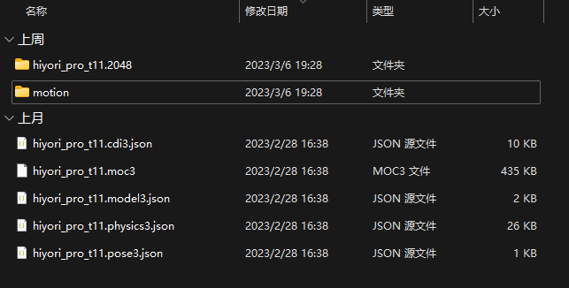
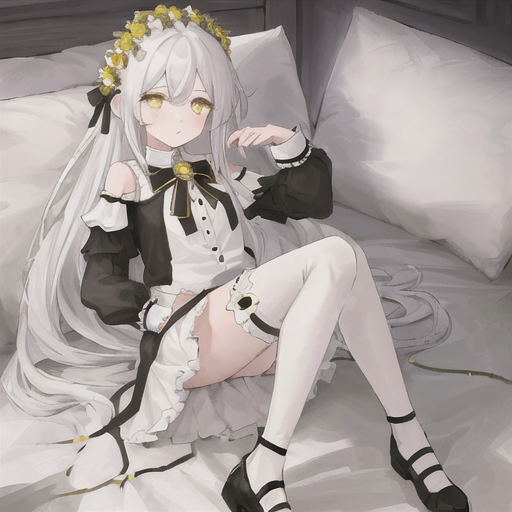
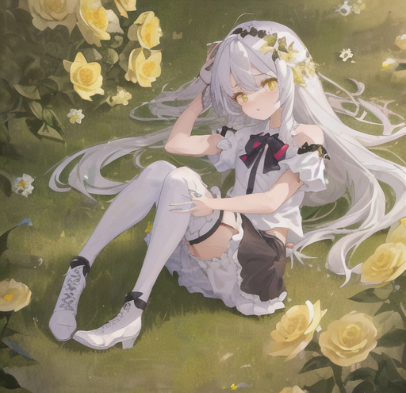
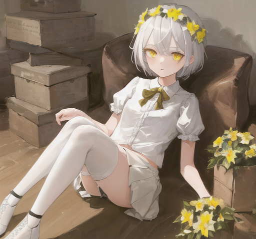
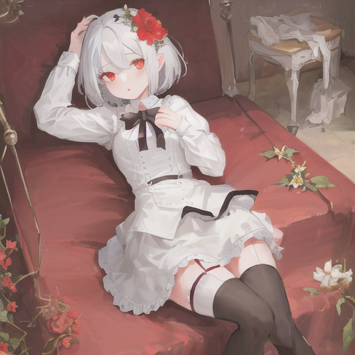
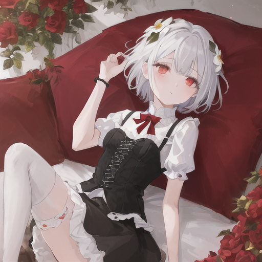

# 语糖live2d皮需求文档

## 硬需求(务必要实现的)
### 1.环境需求
- Cubism Editor 版本 4.0 或以上
- 需要大众审美的建模师大佬
- deadline：一个月 (不包含开工前聊需求的时间)

### 2.交付需求
- 交付文件需要包含以下文件和结构：
- 文件名是自定义的，但是各文件的后缀要符合。
- 拆分的PNG在一个文件夹。
- 自定义按键动作在一个文件夹。
- 外部为配置文件。
- 多余的文件可以不用管。别少就好
- 正常情况下 Cubism Editor 模型导出应该就是这样的结构，只是需要大佬看一眼确认一下。
- 下图是示例：
- 

### 3.人设需求
- 人物性别:女
- 规格：全身
- 人物体型:萝莉
- 人物性格:沉稳/呆萌/慵懒 性格接近与 《No Game No Life》 中的角色：白。(只是性格接近)
- 人物服饰设定风格:大佬看人设发挥，真的不太懂这里，不要照着人设图中的服装做就行了
- 人物发型:长短和款式画师自己发挥，配色为白色，头上需要带个牌子，牌子上写“糖”
- 嘴： 3X3
- 眼睛：果冻眼，比例和嘴协调就行，五官比例，参考Live2D官方桃濑日和
- 白色过膝袜
- 人设图为AI作画，仅供参考！主要问的人多，大佬可以完全不照着人设图走，太限制想象力了。
- 
- 
- 
- 
- 

### 4.自定义动作(可以理解为按键动作)
- 每个动作包含一个表情 (动作和表情是一起的)
  - 空闲时刻的晃动
  - 开心
  - 小脾气(嘟嘴)
  - 委屈
  - 卖萌

### 4.版权需求
#### 可商用使用细则：
- 线上授权(直播，展示，配图，推广，提案，视听作品)
- 线下授权(印刷，出版，户外广告)
- 衍生品制作与销售权
- 转售权
- 二次创作权
- 再分发权

## 软需求(建模师可自行发挥的)
### 1.拆分
- 不需要拆特别细致，正常拆，动的时候看起来不别扭就可以了
- 多少轴和多少度没有硬性要求，只要人物在做自定义动作时看起来协调就行了
- 装饰物在满足，上面第3项 人设需求 的前提下大佬自行发挥
